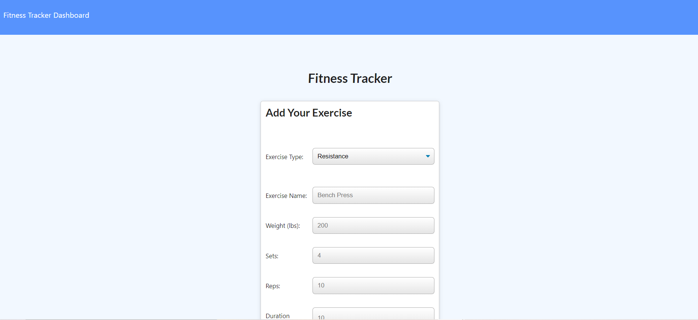

# Professional README.md

Ryan's workout tracker! New and improved!

## Description

This is my fitness tracker to help keep me on track with my weekly workout regimine!! I am also able to track the amount of repetitions and weight I lifted each day. This is a working application and please let me know if you have any suggestions or reccomendations to improve this app.

## License

## Installation

What are the steps required to install your project? Provide a step-by-step description of how to get the development environment running: Within the terminal run with NPM start.

## Usage

Provide instructions and examples for use. Include screenshots as needed: When entering data select either Resistance or Cardio on the homepage. This will lead you to a more detailed page where you can provide all the details of your workout.

## Credits

List your collaborators, if any, with links to their GitHub profiles.
If you used any third-party assets that require attribution, list the creators with links to their primary web presence in this section.
If you followed tutorials, include links to those here as well. undefined

## How to Contribute

If you created an application or package and would like other developers to contribute it, you can include guidelines for how to do so. The [Contributor Covenant](https://www.contributor-covenant.org/) is an industry standard, but you can always write your own if you'd prefer.

## ScreenShot

What is your GitHub username? @ryansswell

What is your email? ryan0425@msn.com

What is the name of your project? Workout Tracker
